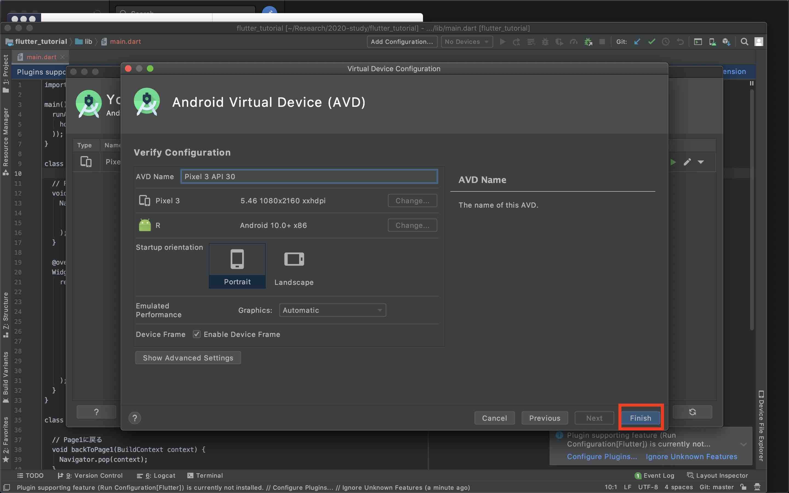

# Flutter Tutorial

## プレゼンテーション

[https://www.slideshare.net/secret/hbgdcWucDVvutJ](https://www.slideshare.net/secret/hbgdcWucDVvutJ)

## 環境設定

### Flutterをインストール

このサイト([https://flutter.dev/docs/get-started/install](https://flutter.dev/docs/get-started/install))を参考にしてFlutterをインストールする。

### Visual Studio Codeをインストール

このサイト([https://code.visualstudio.com/](https://code.visualstudio.com/))を参考にしてVisual Studio Codeをインストールする。

#### Visual Studio CodeにDart言語のExtensionを追加


### Android Studioをインストール

このサイト([https://developer.android.com/studio](https://developer.android.com/studio))からAndroid Studioをインストールする。

#### Emulatorの設定




#### Android SDK Command-line Toolsをダウンロード


### Xcodeの設定（macOSのみ）

```
$ sudo xcode-select --switch /Applications/Xcode.app/Contents/Developer
$ sudo xcodebuild -runFirstLaunch
```


## 実行

```
$ cd 2020-study/flutter_tutorial
$ flutter run
```

エミュレーターを複数立ち上げている場合は以下のコマンド

```
$ flutter run -d <deviceId>
```

### iOSシミュレーターで実行

```
$ open -a Simulator
$ flutter run
```
